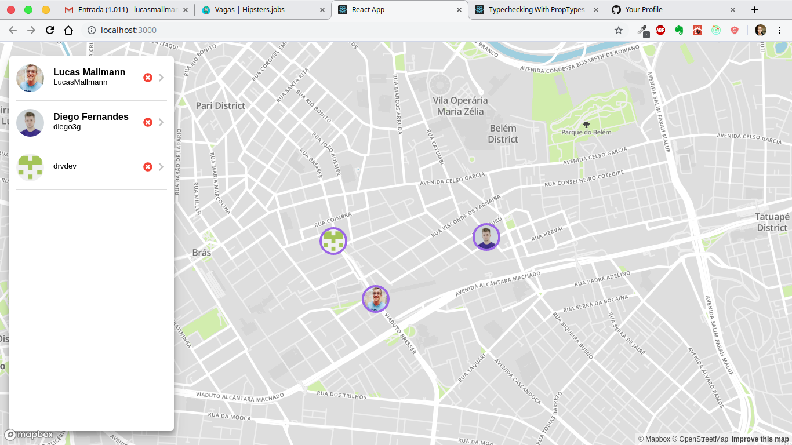
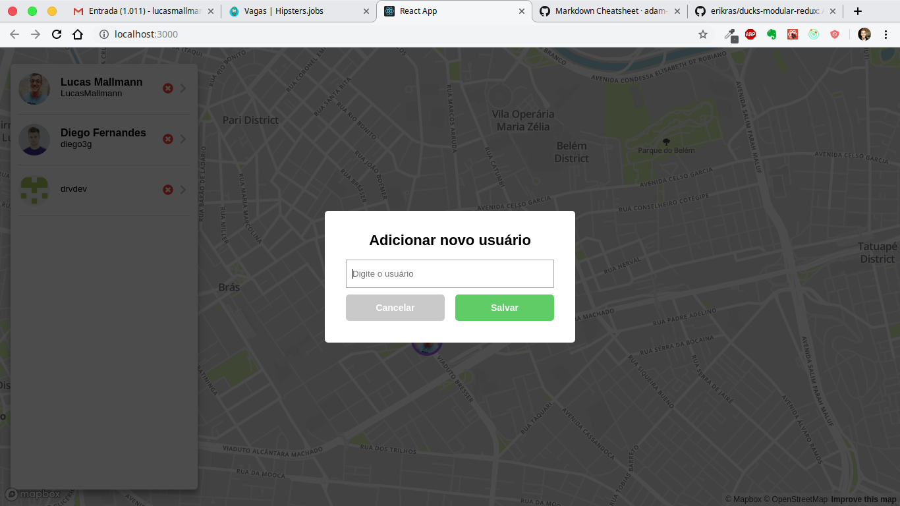
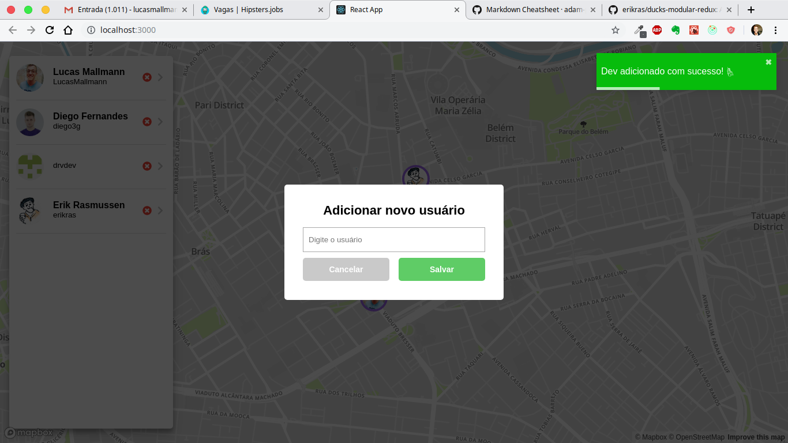
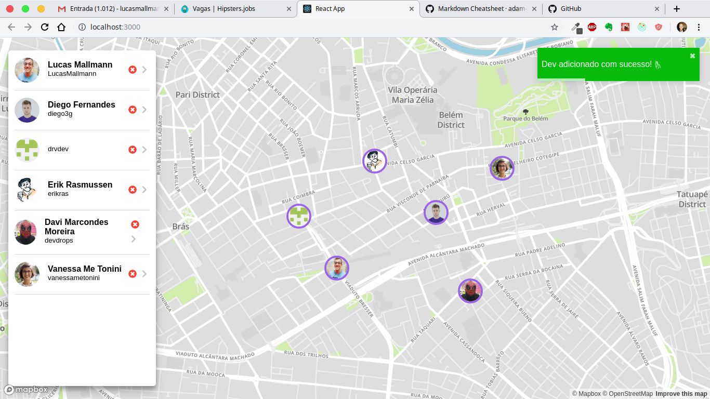

# Dev Location

Aplicação para localização de desenvolvedores utilizando o maps da Uber. Para buscar os desenvolvedores, o projeto utiliza a própria API do Github.

### Download e Instalação

Dentro do repositório, execute `npm install`. Caso esteja utilizando o yarn: `yarn`.

### Arquitetura

Este projeto utiliza o [Redux](https://redux.js.org/) para gerenciamento dos estados, juntamente com a biblioteca [Redux Saga](https://github.com/redux-saga/redux-saga) para realizar operações assíncronas.

Para organizar o store, foi utilizada a arquitetura [Ducks](https://github.com/erikras/ducks-modular-redux) (Vale muito a pena dar uma olhada).

Para a estilização do projeto foi utilizada a biblitoeca [Styled-Components](https://www.styled-components.com/)

### Layout da aplicação

#### Home

### Form

### Feedback

### Success

